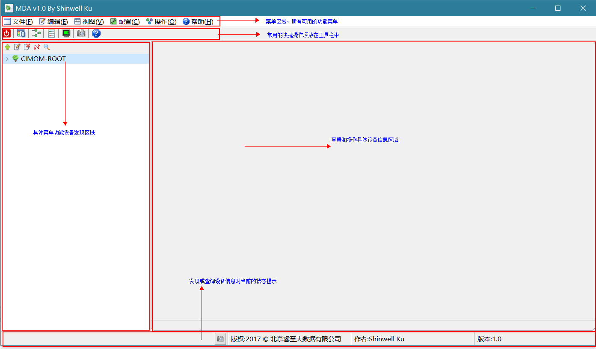

# OpScope

**多协议基础设施监控与诊断工具**

> Scope —— 观测仪。接上一台设备，用 SMI-S / SNMP / SSH / WMI 四种协议看进去：
> 既查得到它的静态配置，也看得到它的性能曲线随时间怎么走。

面向 IaaS 层基础设施（SAN 存储阵列、光纤交换机、磁带库、服务器、网络设备等），
通过远程直连（**无需在目标设备上安装 agent**）完成设备发现、信息查询、性能监控
与故障诊断，并把结果用图表呈现。过去散落在各厂商命令行工具里的排查动作，收敛到
一个桌面应用里完成。

当前版本重点实现了 SAN 网络中**存储阵列与光纤交换机**的发现、查询与性能监控，
其余设备类型的支持在陆续补充。

> 代码内部的包名、类名与构建产物仍沿用早期代号 **MDA**（`com.shinwell.mda`、
> `MdaAppWindow`、`mda.jar`）—— 属于历史沿革，与对外名称无关。



## 功能

### SMI-S（存储管理）

- 存储阵列、光纤交换机、磁带库的发现与信息查询
- 基于 CIM 的对象浏览（`ArrayCimAPI` / `FabricCimAPI` / `TapeCimAPI`）
- Provider 的 Namespace、账号、协议可视化配置，带连接测试
- 阵列与交换机的性能图表

### SNMP

- 设备基础信息查询（`sysDescr`、`sysObjectID` 等标准 MIB）
- 自定义 OID 查询
- SNMP Trap 发送与接收查看

### SSH

- 免交互远程命令执行
- 命令输出回显与保存
- 基于 JSch，附带 SCP 传输与密钥生成工具

### WMI

- Windows 主机信息采集

### 通用

- 中英文双语界面（`zh_CN` / `en_US`），可运行时切换
- 系统托盘常驻
- log4j 运行日志
- 内置 CHM 帮助文档

## 界面


## 环境要求

| 项 | 要求 |
|---|---|
| JDK | **1.8** |
| 构建 | Apache Ant 1.7+，或 Eclipse（仓库带 `.project` / `.classpath`） |
| 图形库 | SWT / JFace —— Windows 与 macOS 两套 native jar 都已放在 `lib/` |

## 快速开始

### 1. 获取代码

```bash
git clone https://github.com/shinwellku/OpScope.git
cd OpScope
```

### 2. 构建

用仓库里的 `build.xml`（**相对路径，开箱可用**）：

```bash
ant -f build.xml
```

默认 target 会依次执行 `compile`（`src` → `bin`）和 `pack`，产物为
`dist/mda-2.1.0-<时间戳>.jar`。

> 源码里有中文，`build.xml` 已指定 `-encoding gbk`，不要去掉这个参数。

> 仓库里另有一个 `build_all.xml`（Eclipse Runnable JAR Export 生成的）。
> **它里面的路径是原构建机的绝对路径**（`D:/myWorkspace/...`、
> `E:/myPrograms/MyEclipse Professional 2014/...`、`C:/Users/ku/Desktop/lib`），
> 换台机器直接跑必然失败，需要先逐条改成你自己的路径。它相对于 `build.xml`
> 唯一的额外价值是会写入 `Main-Class` 清单，可以据此打包成可直接 `java -jar` 的
> 形式。

### 3. 运行

**必须在项目根目录启动** —— 程序通过相对路径读取配置和 Provider 列表
（`conf/applicationContext.xml`、`conf/smis.dat`、`conf/snmp.dat`）。

```bash
# 从编译产物直接跑
java -cp "bin:lib/*" com.shinwell.mda.gui.MdaAppWindow          # macOS / Linux
java -cp "bin;lib/*" com.shinwell.mda.gui.MdaAppWindow          # Windows
```

也可以先给 `ant` 产出的 jar 补上 `Main-Class`（下面用 `dist/mda.jar` 举例）：

```bash
jar cfe dist/mda.jar com.shinwell.mda.gui.MdaAppWindow -C bin .
java -jar dist/mda.jar
```

首次运行会缺少 `conf/ssh.dat`、`conf/wmi.dat`（代码里引用了但仓库中没有），
程序会在你保存 SSH / WMI 配置时自动创建。

### 4. 用 Eclipse 打开

`File → Import → Existing Projects into Workspace`，选中仓库根目录即可。
`.classpath` 中引用了若干 `/Applications/Eclipse.app/Contents/Eclipse/plugins/...`
的绝对路径，**换机器后需要在 Build Path 里重新指向本机 Eclipse 的 plugins 目录**，
否则 SWT / JFace 无法解析。

## 配置

运行时读取 `conf/` 下这些文件：

| 文件 | 用途 |
|---|---|
| `applicationContext.xml` | Spring 容器装配（引入 `-util.xml`，注册 `smisService`） |
| `applicationContext-util.xml` | DMTF 设备类型对照表（`dedicatedMap`） |
| `application.properties` | 全局属性占位符（`PropertyPlaceholderConfigurer`） |
| `smis.dat` | SMI-S Provider 连接列表，序列化的 `HashSet<SmisProvider>` |
| `snmp.dat` | SNMP 设备列表，序列化的 `HashSet<SnmpProvider>` |
| `messages_zh_CN.properties` | 中文界面文案 |
| `MDA-HELP.CHM` | 内置帮助文档 |

`smis.dat` / `snmp.dat` 由界面上的「SMI-S 管理」「SNMP 管理」直接维护，
不需要手工编辑。

设备类型对照表（`applicationContext-util.xml` 中的 `dedicatedMap`）覆盖
DMTF 定义的 0–40、136–138 号类型，含 `Storage`、`FC Switch`、`NAS Head`、
`Virtual Tape Library` 等。

> ⚠️ **不要把你自己的真实设备地址和密码提交进仓库。**
> `smis.dat` / `snmp.dat` 是二进制序列化文件，但其中的字符串（主机名、命名空间、
> 密码）用 `strings` 就能直接读出来。提交前请先把它们换成占位数据。

## 项目结构

```
OpScope/
├── src/com/shinwell/mda/
│   ├── api/            CIM 客户端封装（Array / Fabric / Tape）
│   ├── domain/         数据模型（SmisProvider、SnmpProvider、SwitchModel、SnmpTrap…）
│   ├── gui/
│   │   ├── MdaAppWindow.java   主窗口 / 程序入口
│   │   ├── action/     菜单与工具栏动作（Smis / Snmp / Ssh / Wmi / About）
│   │   ├── composite/  各协议主面板
│   │   ├── dialog/     Provider 配置、OID 查询、Trap 收发、性能图表、快照外壳
│   │   ├── chart/      JFreeChart SWT 图表样例
│   │   └── i18n/       中英文资源
│   ├── service/        Spring 服务（SmisService）
│   ├── sample/         CIM / JSR-48 调用样例与 Indication 测试
│   └── util/           配置、压缩、SCP、密钥、SWT 资源管理等工具
├── conf/               运行时配置、帮助文档、界面截图
├── lib/                第三方 jar（已入库，无需另行下载）
├── bin/                编译输出（已入库）
├── dist/               Ant 打包输出
└── logs/               运行日志
```

## 技术栈

| 用途 | 组件 |
|---|---|
| GUI | Eclipse SWT / JFace 3.x |
| 依赖注入 | Spring 2.5.6 / 3.1.1 |
| SMI-S / CIM | SBLIM CIM Client 2.2.5（JSR-48） |
| SNMP | SNMP4J |
| SSH / SCP | JSch 0.1.54 |
| 图表 | JFreeChart 1.0.19（含 SWT 扩展） |
| 日志 | log4j 1.2 |
| Windows 打包 | exe4j（`mda-built.exe4j` / `mda-built_regular.exe4j`） |

## 已知限制

- `build_all.xml` 与实际 `.classpath` 中的路径均为原构建机环境，需要手工调整
  （见「快速开始 · 2. 构建」）。
- `build_all.xml` 的 `Class-Path` 引用的是 32 位 Windows 的 SWT
  （`org.eclipse.swt.win32.win32.x86_3.102.1`），而 `lib/` 中实际提供的是
  `win32.win32.x86_64` 与 `cocoa.macosx.x86_64` 两套，需要按目标平台对齐。
- 仅 Windows 版做过完整打包验证，macOS 需自行编译运行。
- 仓库未配置 `.gitignore`，`bin/`、`dist/`、`logs/`、`.DS_Store` 等均被纳入版本管理。

## 许可

[Apache License 2.0](LICENSE) © 2019-2026 Shinwell Ku

`lib/` 目录下随仓库分发的第三方库**不适用本许可**，各自仍受其原始许可约束，
详见 [NOTICE](NOTICE)。
